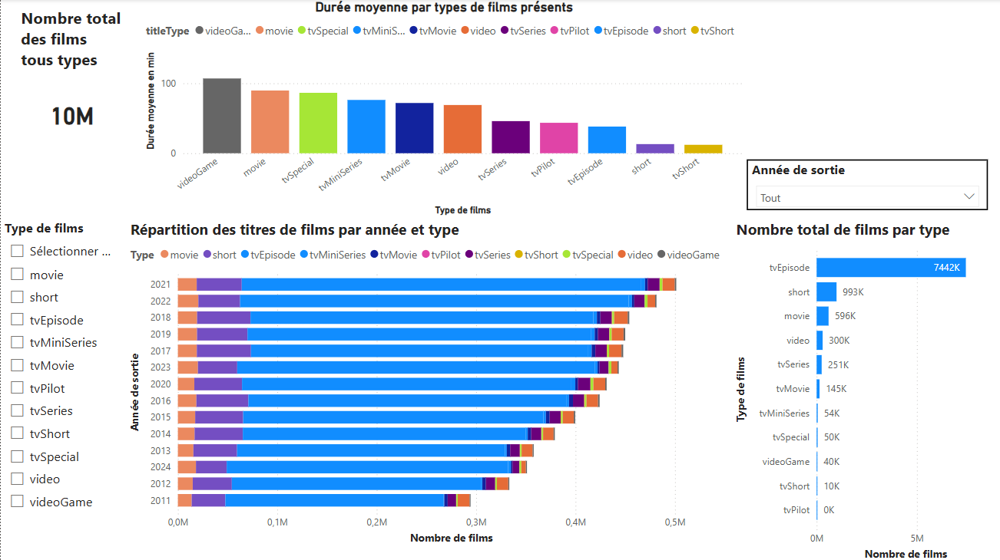
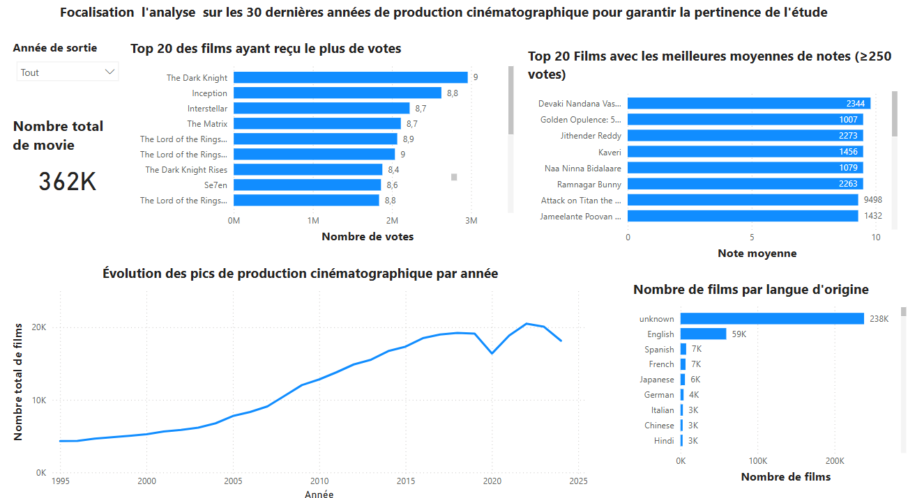
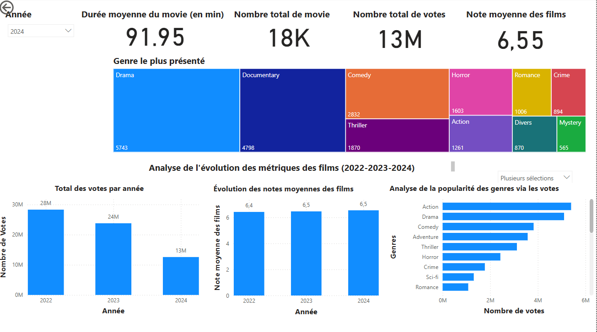
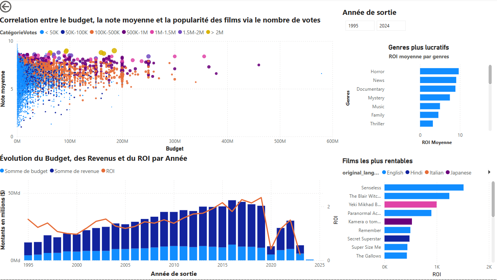
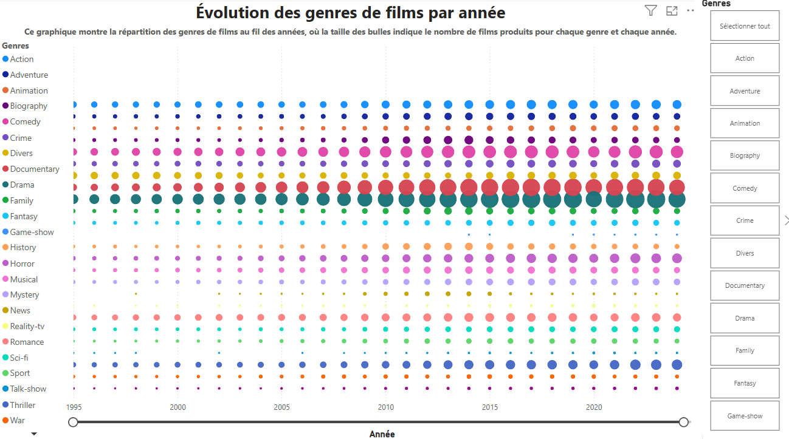
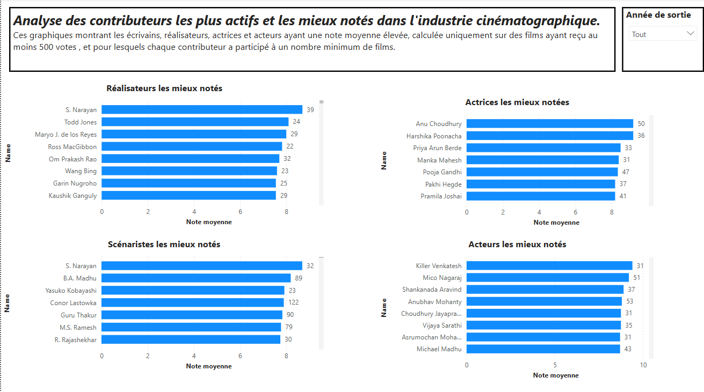

# WCS-Projet2-Recommandation-Films

## Contexte 
Ce projet a pour objectif de concevoir un système de recommandation de films interactif, destiné à enrichir l’expérience en ligne d’un cinéma local. Il repose sur deux volets complémentaires : une analyse exploratoire des données et un moteur de recommandation personnalisé.

Proposer une interface simple permettant de consulter :
- Des statistiques sur les films (durée, genre, etc.)
- Des données sur les acteurs (nombre de films joués, genres associés, etc.)
- Des visualisations interactives pour faciliter l’analyse
  
Dans un second temps, le système de recommandation de films permet à l’utilisateur :
- D’entrer un film (par nom )
- De recevoir des recommandations personnalisées
- D’utiliser le système via une interface dashboard via streamlit : [script du dashboard](https://github.com/ABOUD43/WCS-Projet2-Recommandation-Films/blob/main/dashboard.py)

## Sources de données
Les données sont disponibles sur le site IMDB. Les données sont réparties en plusieurs tables (les films, les acteurs, les réalisateurs, les notes, etc…)
●	La documentation expliquant brièvement la définition de chaque colonne et de chaque table est disponible [ici](https://developer.imdb.com/non-commercial-datasets/).
●	Les datasets sont disponibles [ici](https://datasets.imdbws.com/).
●	Le dataset complémentaire est disponible [ici](https://drive.google.com/file/d/1VB5_gl1fnyBDzcIOXZ5vUSbCY68VZN1v/view) 

## Rapport 
[lien du rapport](https://colab.research.google.com/drive/1FDk44rB1vbgfsDBkgPPiQTCjgcv0fzIW?usp=sharing)

## Power BI 
 Voici un aperçu du tableau de bord développé via Power BI 
 

   
  
  
  
  
  

